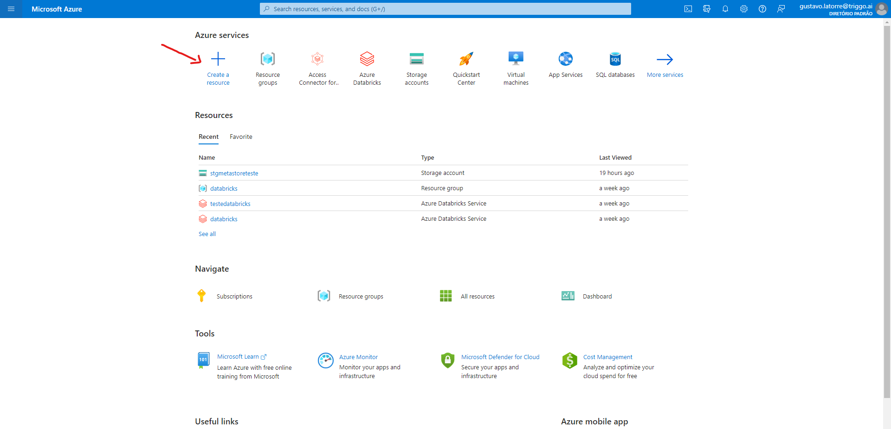
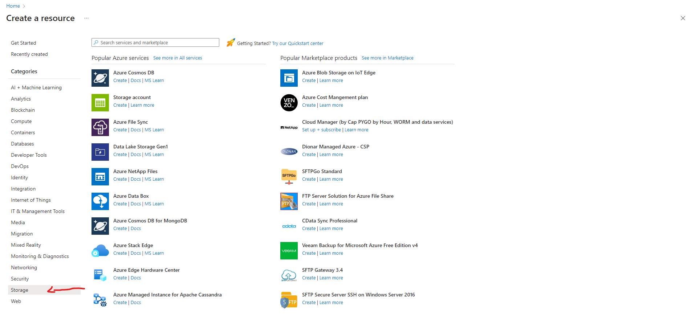
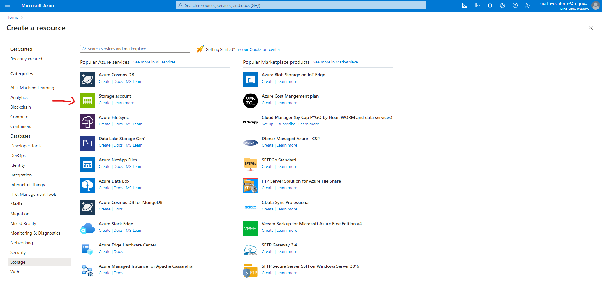
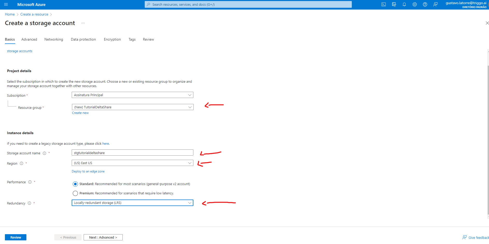
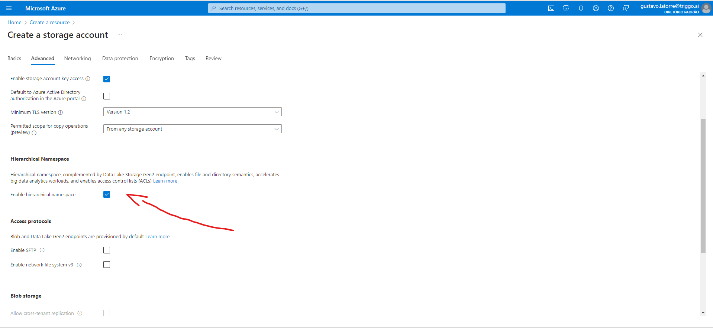
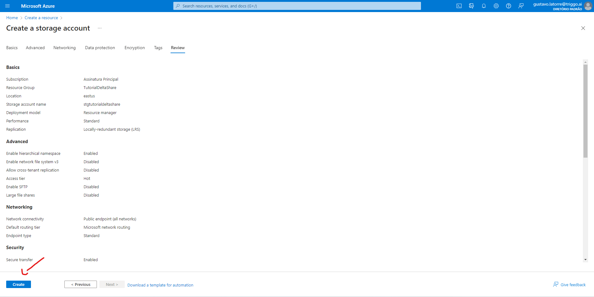

# Delta Share

## O que é Delta Share?

O Delta Share é um protocolo aberto para o compartilhamento de dados com outras organizações independentemente das plataformas de computação usadas. Ele pode compartilhar coleções de tabelas em um metastore do Catálogo do Unity em tempo real sem copiá-las para que os destinatários de dados possam começar a trabalhar imediatamente com a versão mais recente dos dados compartilhados.

Há três componentes no Compartilhamento Delta:
 

*   Provedores:
> Um provedor é uma entidade que disponibilizou dados para compartilhamento.
*   Compartilhamentos:
> Um compartilhamento define um agrupamento lógico das tabelas que você pretende compartilhar.
*   Destinatários:
> Um destinatário identifica uma organização com a qual você deseja compartilhar qualquer quantidade de compartilhamentos.

# Ambiente:

Antes de realizar o Delta Share é necessário a configuração do ambiente. O processo de criação do ambiente será feito na provedor de serviços cloud Microsoft Azure.
 

1.   Login na Microsoft Azure
2.   Criação Storage Account:
- Primeiro clicar em Create a resource

> Depois clicar em Storage

> Selecionar create em Storage account

> Agora escolhemos a Subscrition, Resource group (Pode ser uma que você já tenha ou crie uma nova), o Storage account name, Region e a Redundancy (aconselho selecionar a LRS para baratear) e logo em seguida clicar em Next: Advanced.

> Na página Advanced temos que selecionar a opção em Hierarchical Namespace e após selecionar podemos clicar em Review

> Na página de review verificamos se está tudo certo e casoe steja podemos finalizar com o botão Create para criar o Storage account.
