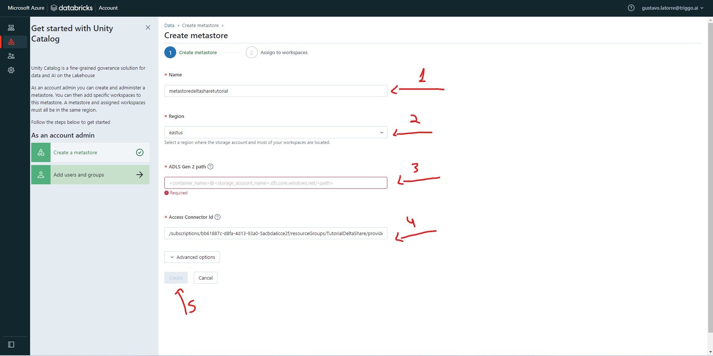

# Delta Share

## O que é Delta Share?

O Delta Share é um protocolo aberto para o compartilhamento de dados com outras organizações independentemente das plataformas de computação usadas. Ele pode compartilhar coleções de tabelas em um metastore do Catálogo do Unity em tempo real sem copiá-las para que os destinatários de dados possam começar a trabalhar imediatamente com a versão mais recente dos dados compartilhados.

Há três componentes no Compartilhamento Delta:
 

*   Provedores:
> Um provedor é uma entidade que disponibilizou dados para compartilhamento.
*   Compartilhamentos:
> Um compartilhamento define um agrupamento lógico das tabelas que você pretende compartilhar.
*   Destinatários:
> Um destinatário identifica uma organização com a qual você deseja compartilhar qualquer quantidade de compartilhamentos.

# Ambiente:

Antes de realizar o Delta Share é necessário a configuração do ambiente. O processo de criação do ambiente será feito na provedor de serviços cloud Microsoft Azure.
 

## 1. Login na Microsoft Azure
## 2. Criação Storage Account:

2.1 Primeiro clicar em Create a resource

2.2 Depois clicar em Storage

2.3 Selecionar create em Storage account

2.4 Agora escolhemos a Subscrition, Resource group (Pode ser uma que você já tenha ou crie uma nova), o Storage account name, Region e a Redundancy (aconselho selecionar a LRS para baratear) e logo em seguida clicar em Next: Advanced.

2.5 Na página Advanced temos que selecionar a opção em Hierarchical Namespace e após selecionar podemos clicar em Review

2.6 Na página de review verificamos se está tudo certo e casoe steja podemos finalizar com o botão Create para criar o Storage account.

2.7 Agora temos que entrar no recurso recém criado para podermos criar um container dentro do Storage account

2.8 Clicar em + Container e uma janela irá aparecer no lado direito. É só dar um nome para seu container e clicar em Create.

## 3. Manager Identity

3.1 Primeiro clicar em Create a resource

3.2 Na caixa de pesquisa procurar por Access Connector for Azure Databricks e selecionar para criar

3.2 Selecionar a Subscription, Resource group, dar um nome e escolher a região e clicar em Review + create para criar 

3.3 Entrar no recurso recém criado para salvar a informação Resource ID para usarmos mais pra frente

## 4. Acesso Manager Identity Data Contributor no Storage Account

4.1 Entrar no Storage account e entrar na página Access Control (IAM) e clicar em + Add e escolher a opção Add role assignment

4.2 Na caixa de pesquisa procurar por storage blob data contributor e selecionar a opção que aparecer, em seguida clicar em Next.

4.3 Na página Members selecionar na seção Assign access to a opção Managed identity e, em seguida clicar em + Select members. Uma janela a direita irá aparecer e lá adicionamos o nosso Access Connector for Azure Databricks. Após isso podemos clicar em Review + create para finalizar.

## 5. Databricks

5.1 Primeiro clicar em Create a resource

5.2 Na caixa de pesquisa procurar por Databricks e selecionar o recurso Databricks para criar.

5.3 Dar um nome para seu workspace e selecionar em Pricing Tirer a opção Premium, após isso podemos clicar em Review + create para finalizar a criação.

5.4 Acessar o Databricks

5.5 Dentro do workspace do Databricks clicar em seu nome e escolher a opção Manage Account

5.6 Agora precisamos criar o Metastore e pra isso clicamos no lado esquerdo em Data e, na páina data clicamos em Create metastore para criar o nosso metastore.

5.7 Dar um nome para seu metastore, escolher uma região, seguir o tutorial que está na parte do ADLS Gen 2 path (nome_do_container@nome_storege_account.dfs.core.windows.net/nome_do_metastore), na parte do Access Connector ID temos que colocar o ID que salvamos no tópico 3.3. Agora é só clicar em Create.

5.8 Se aparecer a seguinte caixa podemos clciar em force create

5.9 Associar o metastore com o worspace que criamos

5.10 Aparecerá uma mensagem para hbilitarmos o Unity Catalog e podemos clicar em enable

## 6. Databricks Delta Share

6.1 Dentro do workspace do Databricks clicar em seu nome e escolher a opção Manage Account

6.2 Acessar o metastore e clicar nele
